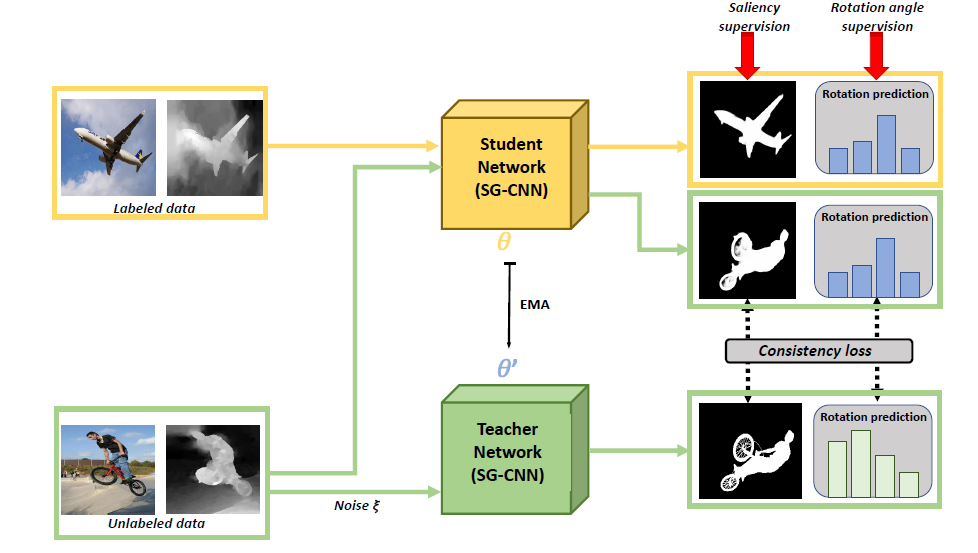

# S$^3$Net: Self-supervised Self-ensembling Network for Semi-supervised RGB-D Salient Object Detection

- This repository is the official implementation of [the paper](https://ieeexplore.ieee.org/document/9623466).





## Our results

- download from the BaiduPan [link]() or Google Drive [link]().

## Prerequisites

```bash
pip install -r requirements.txt
```

## Datasets

- download all the benchmark datasets of RGB-D saliency from this [link](http://dpfan.net/d3netbenchmark/).
- `unzip` them into the same directory.
- configure the `train/test_datasets_root` items of `code/utils/config.py` using the above directory.   
- download the unlabeled RGB-D datasets from SUNRGBD 3D benchmark [link](https://rgbd.cs.princeton.edu/) and discard its semantic labels.

## Train
- configure the `summary_key` item of `code/utils/config.py` for a new experimental run and execute the following scripts.

- Supervised Baseline
```bash
python code/main.py
```
- which will invoke the trainer of `code/utils/solver.py`.

- Semi-supervised Baseline (Vanilla Mean Teacher Framework)
```bash
python code/main_mt.py
```
- which will invoke the trainer of `code/utils/solver_mt.py`.

- Supervised Baseline with Rotation Pretext Learning (Multi-task Learning)
```bash
python code/main_ss.py
```
- which will invoke the trainer of `code/utils/solver_ss.py`.

- Semi-supervised Baseline with Rotation Pretext Learning (**our whole S$^3$Net**)
```bash
python code/main_ss_mt.py
```
- which will invoke the trainer of `code/utils/solver_ss_mt.py`.

## Test

- use the same script as the above for every baseline and adapt the configure `code/utils/config.py` according to your requirements, such as salincy map size and number of the evaluated datasets et al.

## Acknowledge
- thanks to the co-authors for their constructive suggestions.

## License
Copyright 2021 Author of S$^3$Net

Permission is hereby granted, free of charge, to any person obtaining a copy of this software and associated documentation files (the "Software"), to deal in the Software without restriction, including without limitation the rights to use, copy, modify, merge, publish, distribute, sublicense, and/or sell copies of the Software, and to permit persons to whom the Software is furnished to do so, subject to the following conditions:

The above copyright notice and this permission notice shall be included in all copies or substantial portions of the Software.

THE SOFTWARE IS PROVIDED "AS IS", WITHOUT WARRANTY OF ANY KIND, EXPRESS OR IMPLIED, INCLUDING BUT NOT LIMITED TO THE WARRANTIES OF MERCHANTABILITY, FITNESS FOR A PARTICULAR PURPOSE AND NONINFRINGEMENT. IN NO EVENT SHALL THE AUTHORS OR COPYRIGHT HOLDERS BE LIABLE FOR ANY CLAIM, DAMAGES OR OTHER LIABILITY, WHETHER IN AN ACTION OF CONTRACT, TORT OR OTHERWISE, ARISING FROM, OUT OF OR IN CONNECTION WITH THE SOFTWARE OR THE USE OR OTHER DEALINGS IN THE SOFTWARE.

## Citation
```latex
@article{zhu2021s,
  title={S $\^{} 3$ Net: Self-supervised Self-ensembling Network for Semi-supervised RGB-D Salient Object Detection},
  author={Zhu, Lei and Wang, Xiaoqiang and Li, Ping and Yang, Xin and Zhang, Qing and Wang, Weiming and Schonlieb, Carola-Bibiane and Chen, CL Philip},
  journal={IEEE Transactions on Multimedia},
  year={2021},
  publisher={IEEE}
}
```